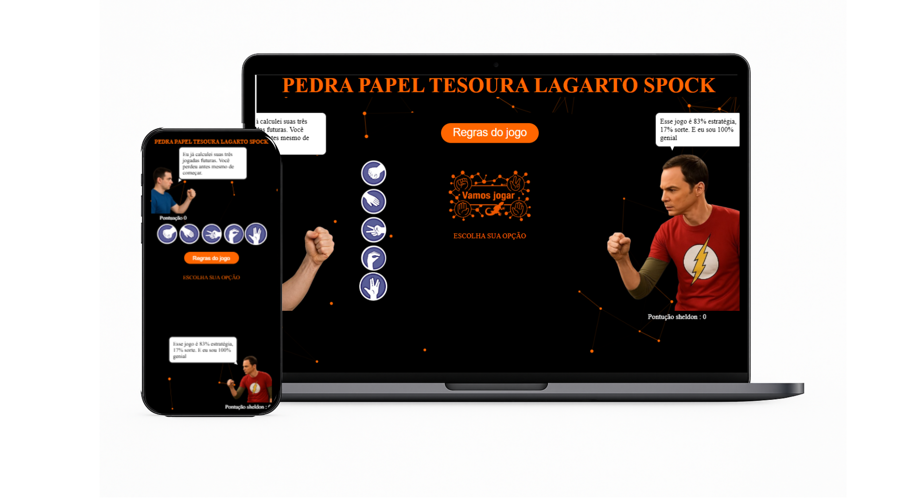

# ✊✋✌️🦎🖖 PPTLS - Pedra Papel Tesoura Lagarto Spock

Projeto desenvolvido como prática de lógica e interatividade com JavaScript, inspirado no clássico jogo Pedra Papel Tesoura, com as adições divertidas de Lagarto e Spock. O objetivo foi criar uma aplicação leve, responsiva e interativa, com foco em aprendizado e diversão.

  

## 💼 Projeto Educacional

Este projeto foi desenvolvido como parte dos meus estudos em desenvolvimento front-end. As principais metas incluíam:
- Aprimorar lógica de programação com JavaScript
- Criar uma interface amigável e responsiva
- Implementar interações dinâmicas e animações
- Trabalhar com manipulação de DOM e eventos

## 📌 Funcionalidades

- Escolha interativa entre as 5 opções do jogo
- Lógica de comparação entre jogador e computador
- Animações e feedback visual do resultado
- Contador de vitórias, derrotas e empates
- Layout responsivo para mobile e desktop

## 🛠️ Tecnologias Utilizadas

| Tecnologia      | Descrição                                      |
|------------------|------------------------------------------------|
| HTML5           | Estrutura da página                            |
| CSS3            | Estilização e responsividade                   |
| JavaScript      | Lógica do jogo e manipulação de eventos                   |
| Google Fonts    | Tipografia personalizada (Poppins & Pacifico)  |

# 📁 Estrutura de Arquivos
/ ├── index.html
  ├── style.css
  ├── script.js
  └── /img
       ├── ícones do jogo (pedra, papel, tesoura, lagarto, spock)
       └── imagens decorativas

## 📷 Visual

Design simples, com ícones claros e animações leves, focando na experiência do usuário e no aprendizado da lógica de jogo. A interface foi pensada para ser intuitiva e responsiva.

## 🧑‍💻 Desenvolvedor

Projeto realizado por [Daniel Guimarães](https://leinadgp.github.io/Portifolio-Daniel/) como parte dos estudos em desenvolvimento web front-end.

## 📞 Contato

📱 WhatsApp: [Clique para conversar](51995531047)  
🌐 GitHub: [@leinadgp](https://github.com/leinadgp)  
✉️ Email: leinadgp@gmail.com

## 📄 Licença

Este projeto está sob a licença — disponível para estudo, adaptação ou uso com crédito.
